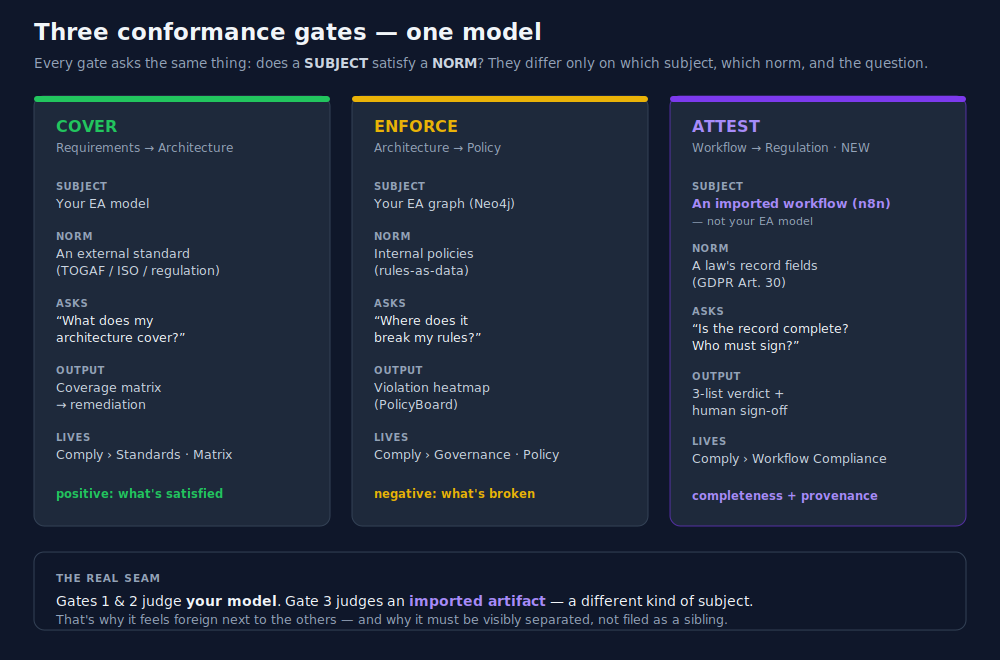

# Handoff — UC-WFCOMP-001 rekursiv modellieren (MiroFish)

**Datum:** 2026-06-28
**Zweck:** Portabler Brief, um das WFCOMP-Feature in einem neuen Chat **rekursiv** in die eigene Architektur (TheArchitect / MiroFish) zu modellieren und zu bewerten.
**Verwandt:** `docs/strategy/2026-06-28-conformance-three-gates.md` · Memory `[[strategy_conformance_three_gates]]`, `[[progress_uc_wfcomp_001]]`, `[[feedback_recursive_development]]`.

---

## Conformance — die drei Tore (Kontextbild)



> **Jedes Tor fragt: Erfüllt ein SUBJECT eine NORM? → wo Lücken?** COVER (Standards/Matrix) · ENFORCE (PolicyBoard) · ATTEST (Workflow→Art.30, NEU). Tor 1+2 bewerten *dein Modell*, Tor 3 ein *importiertes Artefakt*. Volle Analyse: siehe Strategy-Doc.

---

## A. Was diese Session gebaut hat (Fakten-Stand)

| Stück | Status | Wo |
|---|---|---|
| **Slice 3.4** — Assess-Route persistiert (`assessAndStore`) | ✅ merged | PR #14 → master |
| **Recompute-Endpoint** — Mensch attestiert → Feld kippt auf grün | ✅ merged | PR #14 |
| **AC-6** — attestierte Knoten `provenance:'user'` durch Round-Trip | ✅ merged | PR #14 |
| **Security-Review** — PII-Grenze SOUND; 2 Mediums gefixt (Attestations-DoS-Bound, Rate-Limit, LLM_BASE_URL-Doc) | ✅ merged | PR #14 |
| **Smoke-Test-Skript** (6 UseCases über die API) | ✅ lokal | `scripts/wfcomp-smoke-test.sh` |
| **„Assess Workflow"-Frontend-Seite** | ⚠️ **nicht gemerged** | Branch `mganzmanninfo/wfcomp-assess-page`, lokal :3000 |
| **Strategie-Doc** „Conformance — drei Tore" | ⚠️ auf demselben Branch | `docs/strategy/2026-06-28-conformance-three-gates.md` |

**Backend ist live in master. Frontend-Seite + Strategy-Doc liegen auf einem lokalen Branch (nicht gemerged). IA-Entscheidung (drei Tore) ist offen.**

---

## B. Das Feature als Architektur-Elemente (modellierbar)

```
MOTIVATION
  Driver        Trust / Notar-Prinzip · DSGVO Art. 30
  Requirement   "Ehrliche Vollständigkeitsprüfung Workflow ↔ Art. 30"
  Principle     "Maschine sagt nur Sicheres; Mensch attestiert den Rest" (provenance:'user')

BUSINESS
  Service       Workflow Compliance Assessment  = das ATTEST-Tor
  Role          Architect-as-Certifier (Approver) · Workflow-Bringer (User)
  Process       assess → Verdikt prüfen → attestieren → Nachweis-Record

APPLICATION
  Component     WFCOMP Service (server)
    ├ Function  Pipeline: Sanitize → Scope → Lift → Trace   (rein, DB-frei)
    ├ Function  LLM-Inference (swappable: Anthropic ↔ lokal)
    ├ Function  Persist/Load Lifted Graph
    ├ Function  Recompute (Attestierung materialisieren)
    ├ Service   POST /assess     (Perm: ELEMENT_READ)
    └ Service   POST /recompute  (Perm: GOVERNANCE_APPROVE)
  Component     Assess Workflow Page + WfcompVerdict (client)
  Component     Sentry PII-Scrub (cross-cutting)

DATA / TECHNOLOGY
  Data Object   Lifted Compliance Graph  (Neo4j, source:'wfcomp', tenant-scoped)
  Data Object   WfcompAssessment         (Mongo: GapReport-Snapshot + Corpus-Ref)
  Data Object   ART30_FIELDS Spec        (in-code Konstante, 7 Felder a–g)
  Data Object   Corpus-Reference         (regulationKey 'dsgvo:art-30' + versionHash)
  External      n8n Workflow (importiertes Artefakt) · Anthropic/Local LLM · Regulation-Corpus (Server B, THE-367/368)

SCHLÜSSEL-RELATIONEN
  User → /assess → Pipeline → Lift → Trace → Verdikt
  Pipeline → Persist → Neo4j (Graph) + Mongo (Record)
  Approver → /recompute → load(Neo4j) → applyAttestation → Trace → Persist  ⇒ provenance:'user'
  WfcompAssessment ──references──▶ Regulation-Corpus  (Kopie verboten, nur Referenz)
```

---

## C. Was du brauchst, um es im neuen Chat zu modellieren & bewerten

1. **Ziel-Projekt** in TheArchitect (welcher `projectId` / Workspace soll das Modell aufnehmen).
2. **Block B oben** — direkt modellierbar; per **Paste & See** oder **Blueprint-Autofill** importierbar (rekursive Entwicklung: `[[feedback_recursive_development]]`).
3. **Die Bewertungs-Frage für MiroFish** (worüber die 3D-Diskussion laufen soll), z. B.:
   - „Ist das **ATTEST**-Tor sauber von **COVER** (Standards/Matrix) und **ENFORCE** (PolicyBoard) abgegrenzt — oder überlappt es?"
   - „Welche Risiken trägt das Subjekt *importiertes Artefakt*: Drittland-LLM-Export, Tenant-Isolation, Haftung beim Sign-off?"
   - „Wo gehört es in die IA — eigener Top-Level ‚Workflows' oder unter Conformance?"
4. **Referenzen:** PR #14 (merged) · Branch `mganzmanninfo/wfcomp-assess-page` (Page) · `docs/strategy/2026-06-28-conformance-three-gates.md` · Linear **THE-351** (Parent), **THE-360** (Live-Wiring), **THE-356** (Notar-Queue-UI offen), **THE-363** (Tier-B offen), **THE-368** (Corpus-Read offen).
5. **Strategischer Kontext (Memory-Anker):** `[[strategy_conformance_three_gates]]`, `[[strategy_trust_spine]]`, `[[strategy_complexity_comprehension_ux]]`, `[[progress_uc_wfcomp_001]]`.
6. **Offene Entscheidungen, die das Modell prägen:** die 5 Fragen aus dem Strategy-Doc §6 (v. a. *wo lebt ATTEST künftig* — aktuelle Gruppe „Workflow Compliance" ist Übergangslösung).
