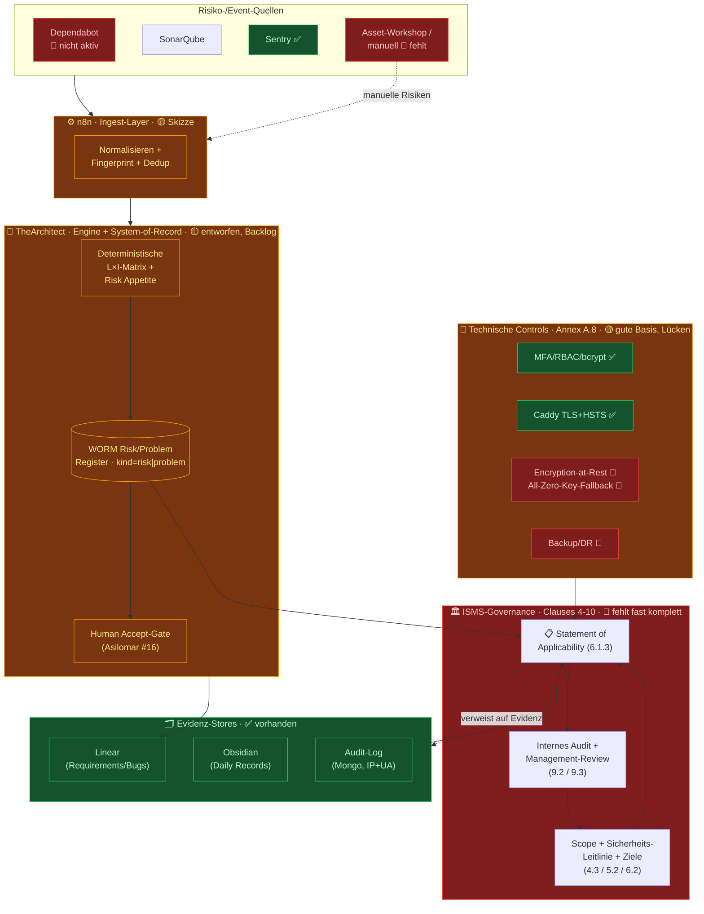

# Statement of Applicability (SoA) — TheArchitect

> **Norm:** ISO/IEC 27001:2022, Annex A (93 Controls, 4 Themen)
> **Status:** `v0.1 — ENTWURF / Vor-Audit-Vorlage`
> **Erstellt:** 2026-07-16 · **Owner:** _(zu benennen: ISMS-Verantwortlicher)_
> **Grundlage:** Analyse von Code (`packages/server`), Deployment (`Caddyfile`, `docker-compose.prod.yml`, `.github/workflows/deploy.yml`), Linear (`UC-RISK-001`/THE-444, `UC-PROBMGMT-001`/THE-443), `docs/strategy/2026-07-11-automated-risk-management.md`.

⚠️ **Diese Vorlage ist kein zertifizierbares Dokument.** Sie ist ein ehrlicher Ist-Stand als Grundlage für ein Vor-Audit. Jede Applicability-Entscheidung und jeder Status muss vom ISMS-Owner bestätigt und mit Evidenz belegt werden. Die Status-Bewertungen sind meine Einschätzung aus dem Code-/Doku-Review — **nicht** ein durchgeführtes Audit.

---

## 0. Wie man dieses Dokument liest

Eine SoA ist das **zentrale Audit-Dokument**. Sie listet **alle 93** Annex-A-Controls und beantwortet pro Control drei Fragen:
1. **Anwendbar?** (Ja / Nein + Begründung)
2. **Umgesetzt?** (Status)
3. **Wo ist der Nachweis?** (Evidenz) — und falls Lücke: **welche Maßnahme?**

**Status-Legende**

| Symbol | Bedeutung |
|---|---|
| ✅ | Umgesetzt — Nachweis vorhanden |
| 🟡 | Teilweise / entworfen aber noch nicht im Betrieb |
| 🔴 | Lücke — nichts vorhanden |
| ⚪ | Vermutlich nicht anwendbar (Begründung erforderlich) |
| ☁️ | Über Cloud-/Hosting-Provider abgedeckt (Nachweis = Provider-Zertifikat) |

---

## 1. Skizze — Ziel-ISMS-Architektur & Ist-Abdeckung

Die Skizze zeigt, wie deine **bestehenden** Bausteine (grün/gelb) in ein ISMS eingebettet werden und wo die **strukturellen Lücken** (rot) sitzen. Kernaussage: Die Risiko-/Problem-Maschinerie ist stark, aber (a) noch nicht im Betrieb und (b) die Governance-Schicht darüber fehlt.

**Lesart:** Der Datenfluss von Quellen → n8n → Engine → Register → SoA existiert **konzeptionell** und ist audit-tauglich entworfen. Was fehlt, ist (1) die **Governance-Schicht oben** (Scope, Policy, SoA, Audit), (2) der **manuelle Asset-Risiko-Pfad** (nicht alles meldet ein Tool), (3) der **Betrieb** (Engine ist Backlog) und (4) einzelne **technische Controls** unten.

---

## 2. Abdeckungs-Überblick

| Thema | Controls | ✅ | 🟡 | 🔴 | ⚪/☁️ |
|---|---|---|---|---|---|
| A.5 Organisatorisch | 37 | 5 | 12 | 17 | 3 |
| A.6 Personen | 8 | 1 | 2 | 4 | 1 |
| A.7 Physisch | 14 | 0 | 0 | 2 | 12 ☁️ |
| A.8 Technologisch | 34 | 11 | 10 | 13 | 0 |
| **Summe** | **93** | **17** | **24** | **36** | **16** |

> Grobe Reifegrad-Einschätzung: **~18 % umgesetzt, ~26 % angefangen, ~39 % offen.** Für einen ersten SoA-Entwurf ohne bestehendes ISMS ist das ein normaler Startpunkt — der hohe 🟡-Anteil bei A.8 zeigt die überdurchschnittlich gute technische Basis.

---

## 3. A.5 — Organisatorische Controls (37)

| Control | Titel | Anwendbar | Status | Evidenz / Lücke → Maßnahme |
|---|---|---|---|---|
| A.5.1 | Policies for information security | Ja | 🔴 | Keine Sicherheitsleitlinie. → Top-Level-Policy schreiben + Leitung freigeben |
| A.5.2 | IS roles & responsibilities | Ja | 🔴 | Kein benannter ISMS-/Sicherheitsverantwortlicher. → Rolle definieren (auch bei Solo-Team formal) |
| A.5.3 | Segregation of duties | Ja | 🟡 | RBAC (7 Rollen) im Code; keine dokumentierte Aufgabentrennung. → Dokumentieren, Grenzen bei kleinem Team benennen |
| A.5.4 | Management responsibilities | Ja | 🔴 | Keine dokumentierte Management-Verpflichtung. → In Policy verankern |
| A.5.5 | Contact with authorities | Ja | 🔴 | Kein Kontakt-Plan (z. B. Datenschutzbehörde bei Breach). → DSGVO-Meldeweg (72 h) dokumentieren |
| A.5.6 | Contact with special interest groups | Ja | 🔴 | → CERT/BSI-Warndienste/OWASP-Bezug festhalten |
| A.5.7 | Threat intelligence | Ja | 🟡 | `UC-RADAR-001` (externer Signal-Scanner) + arXiv-Radar-Reports. → Auf Security-Threats ausrichten |
| A.5.8 | IS in project management | Ja | 🟡 | Linear-RVTM/REQ-Prozess vorhanden; Security als Kriterium nicht explizit. → Security-Gate in Definition-of-Done |
| A.5.9 | Inventory of information & assets | Ja | 🔴 | Kein Asset-Inventar. → Asset-Register (Daten, Systeme, Provider) — Basis für Risikobewertung |
| A.5.10 | Acceptable use of assets | Ja | 🔴 | → Acceptable-Use-Policy |
| A.5.11 | Return of assets | Ja | 🟡 | Offboarding informell. → In HR-/Offboarding-Prozess |
| A.5.12 | Classification of information | Ja | 🔴 | Keine Datenklassifizierung (Kundendaten vs. öffentlich). → Klassifizierungs-Schema (z. B. public/internal/confidential) |
| A.5.13 | Labelling of information | Ja | 🔴 | Folgt aus A.5.12. → Kennzeichnungsregel |
| A.5.14 | Information transfer | Ja | 🟡 | TLS (Caddy) für Transport ✅; keine Transfer-Policy (z. B. Daten an LLM-Provider). → Regeln dokumentieren |
| A.5.15 | Access control | Ja | 🟡 | RBAC + Projekt-ACL (`projectAccess.middleware.ts`). → Access-Control-Policy dokumentieren |
| A.5.16 | Identity management | Ja | ✅ | User-Model, OAuth, eindeutige IDs. → Nachweis dokumentieren |
| A.5.17 | Authentication information | Ja | ✅ | bcrypt cost 12, MFA/TOTP, Reset-Token gehasht. **Aber:** MFA-Secret liegt im Klartext + JWT-Fallback-Secrets → als Risiko führen |
| A.5.18 | Access rights | Ja | 🟡 | Vergabe im Code; **kein periodischer Access-Review**. → Halbjährliche Rezertifizierung + `enterprise_architect`-Autogrant prüfen |
| A.5.19 | IS in supplier relationships | Ja | 🔴 | Hostinger, OpenAI, Anthropic, Firecrawl, MinIO — kein Lieferanten-Assessment. → Lieferantenliste + Bewertung |
| A.5.20 | IS in supplier agreements | Ja | 🔴 | **Keine AV-Verträge (DPAs)** mit Sub-Providern. → DPAs abschließen (kritisch für DSGVO) |
| A.5.21 | IS in ICT supply chain | Ja | 🔴 | Keine Supply-Chain-Kontrolle (npm-Deps). → SBOM + Dependency-Policy |
| A.5.22 | Monitoring of supplier services | Ja | 🔴 | → Periodische Provider-Review |
| A.5.23 | IS for use of cloud services | Ja | 🔴 | Kern-Thema (SaaS auf Hostinger + LLM-Clouds). → Cloud-Security-Policy: wo fließen Kundendaten hin? |
| A.5.24 | Incident mgmt planning | Ja | 🟡 | `UC-PROBMGMT-001` (THE-443) entworfen: Ingest→Dedup→Closed-Loop→SLA. → Bauen + als Incident-Response-Plan dokumentieren |
| A.5.25 | Assessment of IS events | Ja | 🟡 | PROBMGMT: Severity-Klassifizierung + Fingerprint-Dedup (REQ-PROBMGMT-001.2). → Security-Events explizit einschließen |
| A.5.26 | Response to IS incidents | Ja | 🟡 | PROBMGMT Closed-Loop + Sentry-Quelle. → Response-Runbook + Meldefristen |
| A.5.27 | Learning from incidents | Ja | 🟡 | Review-Trigger/Re-Score-Mechanik (Loop-Engineering). → Lessons-Learned-Schritt formalisieren |
| A.5.28 | Collection of evidence | Ja | 🟡 | WORM-Register (append-only) + Audit-Log. → Forensik-/Beweissicherungs-Regel |
| A.5.29 | IS during disruption | Ja | 🔴 | Kein BCP. → Business-Continuity-Plan |
| A.5.30 | ICT readiness for BC | Ja | 🔴 | Keine Backups/DR (siehe A.8.13). → Backup + getesteter Restore |
| A.5.31 | Legal/regulatory requirements | Ja | 🟡 | Produkt kennt DSGVO/NIS2 (Compliance-Pipeline); eigene Rechtspflichten nicht als Register. → Legal-Register (DSGVO, TMG, etc.) |
| A.5.32 | Intellectual property rights | Ja | 🟡 | Private Repo; keine Lizenz-/OSS-Compliance-Prüfung. → OSS-Lizenz-Scan |
| A.5.33 | Protection of records | Ja | 🟡 | Audit-Log vorhanden, **aber keine Retention/kein Schutzkonzept**. → Aufbewahrungsrichtlinie |
| A.5.34 | Privacy & protection of PII | Ja | 🔴 | Account-Löschung **nicht kaskadierend**, **kein Datenexport** (Art. 20). → DSGVO-Betroffenenrechte vollständig umsetzen |
| A.5.35 | Independent review of IS | Ja | 🔴 | → Jährliches unabhängiges Review (kann Vor-Audit sein) |
| A.5.36 | Compliance with policies | Ja | 🔴 | Setzt Policies voraus (A.5.1). → Nach Policy-Erstellung: Compliance-Checks |
| A.5.37 | Documented operating procedures | Ja | 🟡 | `docs/` + Runbooks (LAWOPS) teilweise. → Betriebshandbuch konsolidieren |

---

## 4. A.6 — Personenbezogene Controls (8)

| Control | Titel | Anwendbar | Status | Evidenz / Lücke → Maßnahme |
|---|---|---|---|---|
| A.6.1 | Screening | Ja* | ⚪ | Solo/kleines Team — bei Einstellung relevant. → Regel für zukünftige Hires |
| A.6.2 | Terms & conditions of employment | Ja | 🔴 | → Arbeitsvertrags-Klausel zu IS |
| A.6.3 | IS awareness, education, training | Ja | 🔴 | **Kein Security-Training/Awareness-Nachweis.** → Auch bei Solo: jährliche dokumentierte Schulung |
| A.6.4 | Disciplinary process | Ja | 🔴 | → In Policy/Vertrag verankern |
| A.6.5 | Responsibilities after termination | Ja | 🟡 | Session-Revoke technisch möglich. → Offboarding-Checkliste |
| A.6.6 | Confidentiality / NDA | Ja | 🔴 | → NDA-Vorlage für Mitarbeiter/Freelancer |
| A.6.7 | Remote working | Ja | 🔴 | Remote-Setup (Tailscale erkennbar). → Remote-Work-Policy |
| A.6.8 | IS event reporting | Ja | ✅ | `REQ-PROBMGMT-001.7` Incident-Meldung via Team-Chat (`/report`). → Als Meldeweg dokumentieren |

---

## 5. A.7 — Physische Controls (14)

> **Fast alle physischen Controls sind an den Hosting-Provider (Hostinger) delegiert.** Für ein reines SaaS ohne eigenes Rechenzentrum lautet die Applicability-Begründung: *„umgesetzt durch Provider — Nachweis = dessen ISO-27001-/SOC-2-Zertifikat"*. **Aktion für alle ☁️: Hostinger-Zertifikat/Compliance-Nachweis einholen und als Evidenz ablegen.**

| Control | Titel | Anwendbar | Status | Evidenz / Lücke → Maßnahme |
|---|---|---|---|---|
| A.7.1 | Physical security perimeters | Ja | ☁️ | Hostinger-Rechenzentrum. → Provider-Zertifikat |
| A.7.2 | Physical entry | Ja | ☁️ | Provider |
| A.7.3 | Securing offices/rooms | Ja* | 🔴 | Home-Office/Arbeitsplatz. → Clear-Desk + Arbeitsplatz-Regel |
| A.7.4 | Physical security monitoring | Ja | ☁️ | Provider |
| A.7.5 | Physical & environmental threats | Ja | ☁️ | Provider |
| A.7.6 | Working in secure areas | Nein | ⚪ | Keine Secure Areas. → Begründung: kein eigenes RZ |
| A.7.7 | Clear desk & clear screen | Ja | 🔴 | → Arbeitsplatz-Policy |
| A.7.8 | Equipment siting & protection | Ja | ☁️ | Provider |
| A.7.9 | Security of assets off-premises | Ja | 🔴 | Laptop/Dev-Geräte. → Geräte-Policy (Disk-Encryption) |
| A.7.10 | Storage media | Ja | ☁️ | Provider |
| A.7.11 | Supporting utilities | Ja | ☁️ | Provider |
| A.7.12 | Cabling security | Ja | ☁️ | Provider |
| A.7.13 | Equipment maintenance | Ja | ☁️ | Provider |
| A.7.14 | Secure disposal/re-use | Ja | ☁️ | Provider |

---

## 6. A.8 — Technologische Controls (34)

| Control | Titel | Anwendbar | Status | Evidenz / Lücke → Maßnahme |
|---|---|---|---|---|
| A.8.1 | User endpoint devices | Ja | 🔴 | Keine Endpoint-Policy. → MDM/Disk-Encryption-Regel |
| A.8.2 | Privileged access rights | Ja | 🟡 | RBAC vorhanden; `enterprise_architect` erhält Vollzugriff auf alle Projekte (`projectAccess.middleware.ts:12,35`). → Privileg einschränken + Review |
| A.8.3 | Information access restriction | Ja | ✅ | Projekt-ACL + `authenticate`-Middleware. |
| A.8.4 | Access to source code | Ja | 🟡 | Privates GitHub-Repo. → Branch-Protection + Zugriffsreview dokumentieren |
| A.8.5 | Secure authentication | Ja | ✅ | MFA/TOTP, OAuth-State-CSRF, bcrypt 12, kurze Access-Token. → **Fallback-Secrets fixen** (siehe A.8.24) |
| A.8.6 | Capacity management | Ja | 🟡 | Health-Check `/api/health`; kein Capacity-Monitoring. → Metriken/Alerting |
| A.8.7 | Protection against malware | Ja | 🟡 | Alpine-Container, minimal. → Container-Scan + Regel |
| A.8.8 | Management of technical vulnerabilities | Ja | 🔴 | **Kein Dependabot/`npm audit`/Scan in CI.** → Dependabot + CI-Scan (Kern von UC-RISK-001) |
| A.8.9 | Configuration management | Ja | 🟡 | Docker/Compose/Caddy versioniert; keine gehärtete Baseline. → Config-Baseline dokumentieren |
| A.8.10 | Information deletion | Ja | 🔴 | Account-Löschung nicht kaskadierend (`settings.routes.ts:120`). → Vollständige Löschkaskade |
| A.8.11 | Data masking | Ja | 🟡 | Sentry-PII-Scrub ✅; sonst keine Maskierung. → Bei Bedarf erweitern |
| A.8.12 | Data leakage prevention | Ja | 🔴 | Kein DLP; Kundendaten potenziell an LLMs. → Egress-Regeln + Prompt-Data-Policy |
| A.8.13 | Information backup | Ja | 🔴 | **Keine DB-Backups (Mongo/Neo4j/MinIO), kein Restore-Test.** → Backup-Job + dokumentierter Restore (Top-Priorität) |
| A.8.14 | Redundancy | Ja | 🔴 | Single-VPS, keine Redundanz. → Zumindest dokumentierte Recovery-Zeit (RTO/RPO) |
| A.8.15 | Logging | Ja | 🟡 | pino + Audit-Log ✅; **morgan nur in Dev → keine Prod-Access-Logs** (`index.ts:104`). → Access-Logs in Prod + Log-Retention |
| A.8.16 | Monitoring activities | Ja | 🔴 | Kein Alerting/SIEM. → Monitoring + Alert-Regeln |
| A.8.17 | Clock synchronization | Ja | ☁️ | Container/Host-NTP. → Nachweis dokumentieren |
| A.8.18 | Use of privileged utility programs | Ja | 🟡 | → Regel für Admin-Tools/DB-Zugriff |
| A.8.19 | Installation of software on operational systems | Ja | 🟡 | Image-basiertes Deployment (`UC-DEPLOY-001`). → Change-kontrolliert dokumentieren |
| A.8.20 | Networks security | Ja | 🟡 | Caddy + Tailscale (private Dienste). → Netzsegmentierung dokumentieren |
| A.8.21 | Security of network services | Ja | 🟡 | TLS/HSTS. → Service-Härtung dokumentieren |
| A.8.22 | Segregation of networks | Ja | 🟡 | Tailnet für interne Dienste (Corpus, Data-Server). → Zonen-Konzept |
| A.8.23 | Web filtering | Nein* | ⚪ | Kein Mitarbeiter-Web-Gateway. → Begründung dokumentieren |
| A.8.24 | Use of cryptography | Ja | 🔴 | TLS ✅ + AES-256-GCM für Credentials ✅, **aber:** All-Zero-Key-Fallback (`Connection.ts:5`), JWT-Fallback-Secrets (`auth.routes.ts:293`, `socketServer.ts:12`), **keine Encryption-at-Rest**, MFA-Secret im Klartext. → Krypto-/Key-Mgmt-Policy + Fallbacks entfernen |
| A.8.25 | Secure development life cycle | Ja | 🟡 | RVTM/REQ-Prozess + Tests; kein dokumentierter Secure-SDLC. → SDLC-Policy |
| A.8.26 | Application security requirements | Ja | 🟡 | zod-Validierung in ~12 Routen; uneinheitlich. → Security-Requirements-Standard |
| A.8.27 | Secure system architecture | Ja | 🟡 | ADRs vorhanden; Security-Prinzipien nicht explizit. → Security-by-Design-Prinzipien festhalten |
| A.8.28 | Secure coding | Ja | 🟡 | TS strict; **CSP deaktiviert** (`index.ts:101`), Fallback-Secrets. → Secure-Coding-Standard + CSP aktivieren |
| A.8.29 | Security testing in dev/acceptance | Ja | 🔴 | Kein SAST/DAST/Security-Test-Gate in CI. → Scans in Pipeline |
| A.8.30 | Outsourced development | Nein* | ⚪ | Aktuell keine Fremdentwicklung. → Begründung; Regel für später |
| A.8.31 | Separation of dev/test/prod | Ja | 🟡 | NODE_ENV-Trennung; dev-Fallbacks lecken in Prod-Code. → Saubere Env-Trennung erzwingen |
| A.8.32 | Change management | Ja | 🟡 | Git + Linear + Image-Deploy; **Deploy direkt auf `master` ohne CI-Gate**. → Change-Approval + Test-Gate |
| A.8.33 | Test information | Ja | 🟡 | `docs/testdata`. → Regel: keine echten Kundendaten in Tests |
| A.8.34 | Protection of systems during audit | Ja | 🔴 | → Regel für Audit-Zugriffe |

\* Applicability bei markierten Controls (`Ja*`/`Nein*`) hängt von deiner konkreten Situation ab — vom Owner final zu entscheiden.

---

## 7. Was die SoA NICHT abdeckt — Pflicht-Dokumente (Clauses 4–10)

Die SoA ist Teil von Clause 6, aber ein ISMS braucht darüber hinaus folgende **dokumentierte Information** (ohne die kein Zertifikat):

| Clause | Pflicht-Dokument | Status |
|---|---|---|
| 4.3 | ISMS-Scope-Statement | 🔴 |
| 5.2 | Informationssicherheits-Leitlinie | 🔴 |
| 6.1.2 | Risikobewertungs-Methodik | 🟡 (in `automated-risk-management.md` entworfen) |
| 6.1.3 | Risikobehandlungsplan | 🟡 (WORM-Register-Schema entworfen) |
| 6.1.3 d | **Diese SoA** | 🟡 (v0.1 Entwurf) |
| 6.2 | Messbare Sicherheitsziele | 🔴 |
| 7.2 | Kompetenz-Nachweise | 🔴 |
| 7.5 | Lenkung dokumentierter Information | 🔴 |
| 9.2 | Internes Audit (Programm + Bericht) | 🔴 |
| 9.3 | Management-Review-Protokoll | 🔴 |
| 10.1 | Nichtkonformitäts-/Korrekturmaßnahmen-Log | 🟡 (PROBMGMT-Register deckt Teil ab) |

---

## 8. Empfohlene Reihenfolge (nächste Schritte)

1. **Sofort-Fixes im Code** (Risiken schließen, die im Audit sofort auffallen): All-Zero-Key- + JWT-Fallbacks entfernen (harter Abbruch in Prod), Prod-Access-Logs, Backup-Job + Restore-Test, kaskadierende Account-Löschung, Dependabot/CI-Scan.
2. **Governance-Schicht schreiben:** Scope (4.3), Leitlinie (5.2), Ziele (6.2), Asset-Inventar (A.5.9), diese SoA finalisieren.
3. **Risiko-Engine bauen + betreiben** (UC-RISK-001/PROBMGMT-001) und den **manuellen Asset-Risiko-Pfad** ergänzen — dann läuft echte Evidenz auf.
4. **Lieferanten:** DPAs mit Hostinger/OpenAI/Anthropic/Firecrawl, Cloud-Security-Policy (A.5.19–A.5.23), Datenfluss-Diagramm (wo landen Kundendaten?).
5. **Nach ~3 Monaten Betrieb:** internes Audit (9.2) + Management-Review (9.3), dann Zertifizierungsaudit Stage 1.

---

_Dokument-Historie: v0.1 (2026-07-16) — Erst-Entwurf aus Repo-/Linear-/Doku-Analyse. Nächster Schritt: Owner benennen, Applicability-Spalte bestätigen, Evidenz-Links ergänzen._
