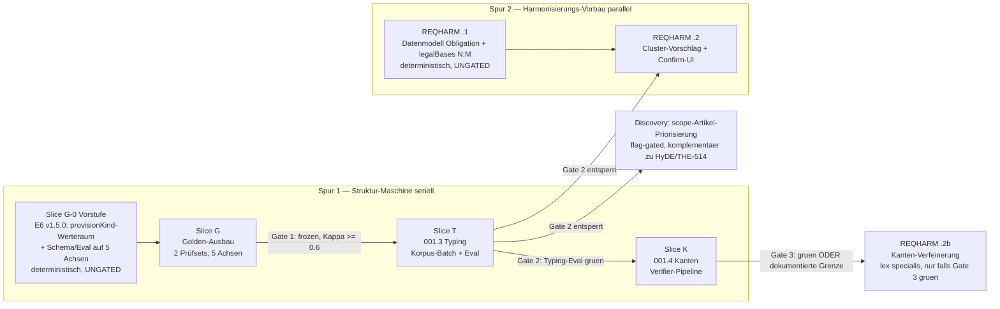

# ONTO→REQHARM-Pfad — Design-Spec (Struktur-Maschine → Gesetzes-Harmonisierung)

**Datum:** 2026-07-19 · **Status:** vom User abgenommen (Brainstorm-Session) · **Commit-Basis:** master `47980e4`
**Linear:** THE-421 (UC-ONTO-001, Parent) · THE-432 (001.3) · THE-433 (001.4) · THE-438 (UC-REQHARM-001)
**Vorarbeiten (Done, auf master verifiziert):** THE-429 Ontologie-Datei v1.4.0 inkl. relationTypes-Registry (PR #35) · THE-430 Typing-Eval-Pipeline — NUR Typing-Teil (PR #55) · THE-431 C_score (PR #55)

---

## 1. Zielbild (EA-Sicht)

Gesetzes-Harmonisierung: **Eine Pflicht, N Rechtsgrundlagen, 1× erfüllt.** Risikomanagement aus LkSG §4 + CSRD + UNECE R155 erscheint als EINE harmonisierte Pflicht mit drei Rechtsgrundlagen; eine Umsetzung deckt alle drei ab („einmal umsetzen, mehrfach nachweisen").

Dafür braucht es die **Struktur-Maschine** (UC-ONTO-001): (a) jeder Gesetzes-Paragraph bekommt Katalog-Attribute (Klassifizierung), (b) die Beziehungen zwischen Gesetzen werden zur Abhängigkeits-Landkarte (verdrängt / überschneidet / präzisiert). Erst mit (a) kann Harmonisierung Pflichten mit Pflichten vergleichen; (b) verfeinert die Zusammenlegung (Spezialgesetz-Logik).

**Vom User entschiedene Weichen (2026-07-19):**
1. **ONTO-first**: erst Struktur-Maschine messbar, dann Harmonisierung darauf.
2. **Relations-Prüfset**: 3 Gesetzes-Paare — DORA↔NIS2 (lex specialis), DSGVO↔NIS2 (Pflicht-Überschneidung, Harmonisierungs-Kernfall Art. 32↔Art. 21), DSGVO↔ePrivacy (Präzisierung).
3. **Label-Workflow**: Claude als Erst-Rater + **MikeOSS als Zweitrater**, User adjudiziert nur Disagreements (Kappa ≥ 0,6 → frozen).
4. **provisionKind** wird fünfte Typing-Achse (nützt Discovery UND Harmonisierung).
5. **Gestuftes REQHARM-Gate**: hart auf Typing (Gate 2), weich auf Kanten (Gate 3 — „dokumentierte Grenze" ist akzeptables Ergebnis, Harmonisierung läuft dann ohne Kanten).

## 2. Pfad-Architektur (Zwei-Spur-Modell)

**Slice G-0 (Vorstufe, deterministisch, ungated):** Damit die Golden-Labelei auf 5 Achsen überhaupt starten kann, müssen VOR Slice G existieren: (a) der `provisionKind`-Werteraum in der Ontologie (E6 v1.5.0, reiner Daten-PR), (b) die Erweiterung von `TypingLabelsSchema`/`TYPING_AXES`/`runTypingEval.ts` auf die fünfte Achse. Beides ist Handwerk ohne KI-Anteil — löst die sonst zirkuläre Abhängigkeit (Golden braucht die Achse, die Achse stand bisher in Slice T).

Begründung Zwei-Spur: REQHARM .1 ist reine Datenmodell-Handwerksarbeit ohne KI-Anteil → braucht keine Prüfungen, nutzt die Wartezeit der Golden-Adjudikation. Die Spuren berühren disjunkte Flächen (Eval/Ontologie vs. Mongo-Model) → geringes Konfliktrisiko.

## 3. Slice G — Golden-Ausbau (die zwei Prüfungs-Stichproben)

**Befund:** Der Relations-Golden fehlt komplett (THE-430 lieferte nur Slice 1 = Typing); der Typing-Golden (`typing.fixture.json`) ist frozen:true mit nur **4 Cases** — als Baseline zu dünn.

### G-a: Typing-Golden-Ausbau (4 → ~60-80 Cases)
- Stratifiziert über **Quelle** (alle 9 Gesetze vertreten), **Sprache** (DE/EN) und **C_score** (komplexe Normen müssen vertreten sein — C_score existiert, `packages/server/src/norms/complexityScore.ts`).
- Gelabelt auf **5 Achsen**: NormKind, Bindingness, Obligation-Art, PartyRole + **provisionKind** (neu, Werteraum aus Slice G-0).
- Bestehende frozen-Mechanik (`typingGolden.ts`: Kappa ≥ 0,6 + Adjudikation, RUBRIC.md §7) wird benutzt, nicht neu erfunden.

### G-b: Relations-Golden (neu, ~80-120 Paare)
- **Paar-Räume:** DORA↔NIS2, DSGVO↔NIS2, DSGVO↔ePrivacy.
- **Kandidaten-Vorauswahl statt Vollkreuzprodukt:** Embedding-Similarity-Top-Paare + bekannte Anker (DORA Art. 1/2 referenziert NIS2 explizit; DSGVO Art. 32↔NIS2 Art. 21; ePrivacy↔DSGVO Art. 95) + **bewusste Negativ-Paare** (`none`-Label; ohne Negative ist Precision nicht messbar).
- **Label-Raum:** die bestehende relationTypes-Registry der Ontologie v1.4.0 (`TRANSPOSES`, `DEROGATED_BY`/`PREVAILS_OVER`, `SETS_PARAMETER`, `INTERPRETS`, …) **oder `none`**. Kein neuer Relationsraum.
- Schema/Loader analog `typingGolden.ts` (frozen-Flag, Dedup-Guard, Zod-validiert).

### Zweitrater-Workflow (für beide Sets)
1. Claude draftet alle Labels (mit Begründungs-Notiz je Label).
2. **MikeOSS** rated unabhängig (Gesetzestexte sind öffentlich → gehostete Demo oder Self-Host zulässig; BYO-Key).
3. Kappa je Achse/Relationstyp (bei n ≥ 10; seltene Typen über Macro-Kappa, siehe unten); Disagreements (erwartet ~10-25) gehen an den User als Schiedsrichter.
4. Kappa ≥ 0,6 → `frozen: true`. **Gate 1 offen.**

**Kappa bei seltenen Relationstypen:** Per-Typ-Kappa nur wo n ≥ 10 Paare; darunter ist Cohen's Kappa instabil → für seltene Typen zählt der **aggregierte (Macro-)Kappa** über den gesamten Relations-Set, und der Eval-Report weist die dünnen Typen explizit als „n zu klein für Einzel-Kappa" aus. Die Adjudikation bleibt trotzdem je Einzelfall.

**Fallback (falls MikeOSS-Zugang hakt):** Zweitrater = anderes Modell-Haus (Gemini direkt, unabhängiger Prompt). Die Kappa-Messung bleibt ehrlich, solange die Rater unabhängig sind. → Offener Punkt O-1.

## 4. Slice T — 001.3 Typing (THE-432)

**EA-Sicht:** Jeder Paragraph bekommt Katalog-Attribute — wie Element-Typisierung im Architektur-Repository. Vorschlag mit Herkunftsnachweis, kein Fakt.

**Technisch:**
- **Vorausgesetzt (aus Slice G-0):** `provisionKind` ist bereits in der Ontologie (E6 v1.5.0, Werteraum `scope-applicability | definition | obligation | enforcement-supervision | procedural | other`) und Schema/Eval sind auf 5 Achsen erweitert. Slice T ist damit reiner Batch + Eval-Lauf.
- **Batch-Job** über die 1532 §§ (Korpus-Mongo, Server B / `CORPUS_MONGODB_URI`): Haiku-Instruct (Paper-Befund 4: Instruct schlägt Thinking bei Typing), Tool-Use-JSON gegen den geschlossenen Typraum, halluzinierte Werte gedroppt (Muster `complianceMapping.service.ts`).
- **Persistenz am Korpus-Doc** (additiv): `typing: { normKind?, bindingness?, obligationType?, partyRole?, provisionKind?, confidence, modelId, ontologyVersion, typedAt, status: 'suggested' }`. Kein Human-Confirm je § (1532 Einzel-Confirms unrealistisch) — Qualität wird stattdessen am frozen Golden **gemessen**; Stichproben-Confirm-UI ist späterer, separater Scope.
- **Eval:** per-Achse F1 + Kalibrierung am frozen Golden (Metriken jenseits F1 existieren aus THE-430; die 5-Achsen-Erweiterung des Runners kam in G-0). Schwellen für Gate 2 werden **im Plan** fixiert (nach erstem Golden-Durchlauf seriös setzbar) → Offener Punkt O-2.
- **Discovery-Nutzen (entsperrt durch Gate 2, nicht früher):** `scope-applicability`-Provisions im Discovery-Retrieval priorisieren bzw. je Familie garantiert dem Judge vorlegen — der THE-423-belegte Hebel (CRA bekam nur Enforcement-§§, nie Art. 2), komplementär zur query-seitigen HyDE-Übersetzung (THE-514, live). Flag-gated, dark by default (Muster `LAW_DISCOVERY_HYDE`). Bewusst hinter Gate 2: keine Retrieval-Priorisierung auf ungemessenen Labels („kein Suggest ohne Baseline").

## 5. Slice K — 001.4 Kanten (THE-433) — das Risiko-Slice

**EA-Sicht:** Die Abhängigkeits-Landkarte zwischen Gesetzen. Ehrliches Risiko: DE-Rechtstext-Relationserkennung ist empirisch unbelegt — darum Prüfung zuerst, „dokumentierte Grenze" ist akzeptables Ergebnis.

**Technisch:**
- Verifier-Pipeline (Paper §4.3): Kandidaten-Paare (gleiche Vorauswahl-Mechanik wie G-b) → verbalisierte Query → Relation aus der relationTypes-Registry oder `none` → LLM-Verifikation in Kaskade (Haiku schlägt vor, Sonnet verifiziert — THE-401-Muster).
- **Persistenz: Neo4j-Norm-Graph** (THE-390) als `suggested`-Kanten mit `{ relationType, confidence, modelId, ontologyVersion, status: 'suggested', provenance }`. Kein Auto-Commit als Fakt (Asilomar #16).
- **Gemessen am Relations-Golden** (G-b). Gate 3 = Precision ≥ Schwelle (O-2) **oder** dokumentierte Grenze (Eval-Report mit Fehlermodus-Analyse; REQHARM läuft dann ohne Kanten).

## 6. Spur 2 — REQHARM-Vorbau (THE-438)

**EA-Sicht:** Heute gehört jede Anforderung zu genau EINEM Gesetz — deshalb Duplikate. Der Umbau gibt einer Pflicht mehrere Rechtsgrundlagen. Behutsam neben dem Bestehenden, Demo-Daten bleiben intakt, Rückweg vorhanden.

**REQHARM .1 (parallel, ungated — deterministisch, kein KI-Anteil):**
- `Obligation`-Entität + `legalBases: [{ normId, sectionEId }]` N:M, **additiv** auf `ComplianceRequirement` (Strangler: bestehendes `regulationId` bleibt Anker bis Cutover; heutiger Stand: genau ein `regulationId`, Unique-Index `{projectId, regulationId, title}`).
- Migrationspfad für BSH-Demo-Daten + Rollback. Details (Indizes, Coverage-Mathematik) im Plan.

**REQHARM .2 (startet bei Gate 2):** Cluster-Vorschlag = Typing-Bucket (Obligation-Provisions gleicher Art) → Embedding-Fein-Similarity → LLM-Kaskade „ist das wirklich dieselbe Pflicht?" → **Human-Confirm-UI** (Merge nur nach Architekten-Bestätigung, Provenance getrackt).

**REQHARM .2b (nur falls Gate 3 grün):** Kanten-Verfeinerung — lex specialis (DORA verdrängt NIS2 → eine Rechtsgrundlage dominiert), `SETS_PARAMETER`/`INTERPRETS` als Zusatz-Evidenz im Cluster.

Weitere REQHARM-REQs (.3 Merge-UI-Ausbau, .4 Coverage/Gap-Umstellung, .5 Dashboard, .6 Tests/Migration, .7 End-to-End-Traceability) folgen nach .1/.2 — Zuschnitt im THE-438-Ticket, nicht Teil dieser Spec-Phase.

## 7. Quality Gates (Zusammenfassung)

| Gate | Kriterium | Entsperrt |
|---|---|---|
| **G1** | Beide Golden-Sets frozen (Kappa ≥ 0,6 je Achse und je Relationstyp mit n ≥ 10; seltene Typen über Macro-Kappa, siehe §3; User-Adjudikation abgeschlossen) | Slice T Eval, Slice K Eval |
| **G2** | Typing-Eval grün am frozen Golden (Schwellen: O-2) | REQHARM .2 (Cluster) + Discovery-provisionKind-Priorisierung |
| **G3** | Kanten-Precision ≥ Schwelle **oder** dokumentierte Grenze | .2b Kanten-Verfeinerung (nur bei grün); bei Grenze: REQHARM läuft ohne Kanten |

## 8. Offene Punkte (im Plan zu fixieren)

- **O-1 MikeOSS-Zugang:** Demo vs. Self-Host (Server B/Coolify) — Ops-Entscheid vor Slice G. Fallback: Gemini als Zweitrater (unabhängiger Prompt).
- **O-2 Schwellenwerte G2/G3:** per-Achse-F1/Precision-Ziele erst nach erstem Golden-Durchlauf seriös setzbar; Paper-Referenz (F1 bis 82,7 % Term Typing) ist Orientierung, NICHT importierbar (DE-Recht nicht im Paper-Benchmark).
- **O-3 Kanten-Persistenz-Detail:** genaues Neo4j-Kanten-Schema mit THE-390-Konventionen abgleichen (Plan-Phase).

## 9. Out of Scope (bewusst)

- 001.6 Stage-1-Retrieval (THE-434) — on-demand, Re-Score-Trigger definiert.
- Stichproben-Confirm-UI für Typing — nach Slice T, separater Scope.
- REQHARM .3–.7 — nach .1/.2.
- HyDE-Default-on (THE-514) — läuft parallel als Beobachtung, unabhängig von diesem Pfad.
- Auto-Commit von Typen/Kanten als Fakten — alles bleibt Vorschlag mit Confidence + Provenance (Asilomar #16).

## 10. Erfolgs-Kriterien des Pfads

1. Zwei frozen Golden-Sets mit ehrlicher Zwei-Rater-Kappa (G1).
2. Typing-Qualität **gemessen** (nicht angenommen) über 5 Achsen; Korpus voll typisiert als Vorschlags-Layer (G2).
3. Kanten-Qualität gemessen — Ergebnis grün **oder** dokumentierte Grenze mit Fehlermodus-Analyse (G3).
4. Discovery legt Geltungsbereichs-Artikel vor (messbar via ContextTrace/THE-423: `provisionKind`-Verteilung der fed-Sets vorher/nachher).
5. REQHARM-Datenmodell live (additiv, Demo-Daten intakt); erster bestätigter Cluster „eine Pflicht, N Rechtsgrundlagen" auf einem echten Projekt.
